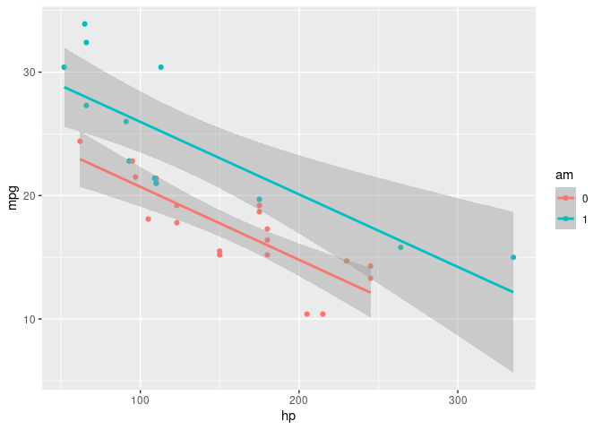

# targets_mtcars

<!-- badges: start -->
<!-- badges: end -->

The goal of targets_mtcars is to demonstrate the use of targets to do a
small analysis and make a document.

Packages used here:

``` r
library(tidyverse)
```

    ## ── Attaching core tidyverse packages ──────────────────────── tidyverse 2.0.0 ──
    ## ✔ dplyr     1.1.4     ✔ readr     2.1.5
    ## ✔ forcats   1.0.0     ✔ stringr   1.5.1
    ## ✔ ggplot2   3.5.1     ✔ tibble    3.2.1
    ## ✔ lubridate 1.9.3     ✔ tidyr     1.3.1
    ## ✔ purrr     1.0.2     
    ## ── Conflicts ────────────────────────────────────────── tidyverse_conflicts() ──
    ## ✖ dplyr::filter() masks stats::filter()
    ## ✖ dplyr::lag()    masks stats::lag()
    ## ℹ Use the conflicted package (<http://conflicted.r-lib.org/>) to force all conflicts to become errors

``` r
library(flextable)
```

    ## 
    ## Attaching package: 'flextable'
    ## 
    ## The following object is masked from 'package:purrr':
    ## 
    ##     compose

``` r
library(targets)
```

We use the `mtcars` data, summarized thus:

``` r
tar_read(mtcars_summary) %>% 
  flextable()
```


and make a graph thus:

``` r
tar_read(mtcars_plot)
```

    ## `geom_smooth()` using formula = 'y ~ x'

<!-- -->
